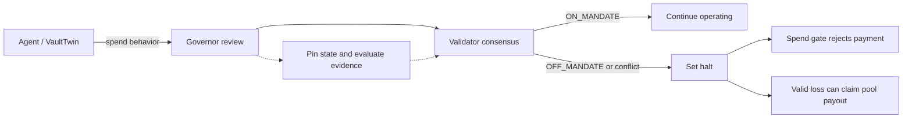

# Stele operator guidance

This document is the operational companion to the contract and demo. It is
written for an operator, reviewer, or judge who needs to understand what is
safe to do, what must be verified, and what remains platform-dependent.

## Current deployment boundary

The primary Bradbury Governor used by the canonical evidence is:

`0x36b49eFFd0b9d5C47D8Cf93734BE34b911a6c3C9`

The current deployed Governor has no enrollment-repair method. Enrollment is
write-once for an agent: a second enrollment reverts. The repair-only fork has
been storage-diff tested in Studio, but it has not been upgraded onto Bradbury.
Do not describe the repair path as live functionality.

Bradbury deployment and upgrade transactions can take several minutes to reach
finality. A wallet receipt or explorer `ACCEPTED` status is not the same as
successful contract execution. Always inspect the execution result, and do not
submit a follow-up action until the prior action has reached a terminal result.

## Threat model

| Threat or failure | Required control | Operator response |
| --- | --- | --- |
| A wallet address is entered as the VaultTwin address | Verify contract code, `agent_state()`, agent identity, and Governor identity before enrollment | Stop enrollment; use the actual deployed VaultTwin address |
| The same agent is enrolled twice | Governor’s one-enrollment invariant | Treat the second attempt as an expected revert; recover the existing enrollment instead of retrying |
| A VaultTwin belongs to another agent or Governor | Read back both identities before signing | Reject the address and deploy/choose a matching VaultTwin |
| Deployment is accepted but not executable | Separate receipt/consensus state from execution status | Wait for finalization and surface the actual execution failure |
| Review targets a demo agent instead of the connected enrollment | Keep the active review target explicit in the UI | Confirm target agent and Governor before pressing Review |
| Review evidence is unavailable, malformed, or conflicting | Fail closed with `REVIEW_FAILED` or `EVIDENCE_CONFLICT` | Do not claim a valid verdict; investigate the evidence path |
| An off-mandate ruling is disputed | Bond, halt, and claim path | Inspect the ruling, pinned state, and claim window before claiming |
| A halted vault attempts to spend | Vault checks Governor halt state | Expect the spend to revert; do not interpret it as a deployment failure |
| Bradbury RPC or consensus stalls | One action at a time and explicit terminal-state checks | Preserve the transaction hash, stop retries, and check the network/tooling issue |
| A live Governor upgrade changes storage behavior | Full field-by-field pre/post state diff | No live upgrade without an isolated test pass and explicit go-ahead |

The threat model assumes an honest operator can still make mistakes and that
the network can return incomplete or delayed information. The UI is a guardrail;
the contract’s enrollment and halt invariants remain the security boundary.

## Invariant table

These are the properties the walkthrough and any future deployment should
preserve.

| Invariant | Meaning | Evidence/check |
| --- | --- | --- |
| One enrollment per agent | `vault_of[agent]` is assigned only on first enrollment | Second enrollment must revert; read back the stored vault |
| Vault is a contract | The enrollment target has deployed code | `eth_getCode` from the operator/frontend before submission, plus contract-level validation where available |
| Vault identity matches | The VaultTwin reports the connected agent | Read `agent_state()` and compare with the enrolling wallet |
| Governor identity matches | The VaultTwin points at the active Governor | Read `get_governor()` and compare with the configured Governor |
| Mandate is non-empty | Every enrolled agent has a meaningful rule | Reject blank/whitespace-only mandate text |
| Review has an explicit target | The displayed target is the enrolled agent or an intentionally labeled fixture | Compare the target address, Governor, and UI label before submission |
| Execution status is authoritative | A transaction is successful only after execution resolves successfully | Show consensus/receipt and execution separately; never treat receipt existence as success |
| Review is fail-closed | Unavailable, malformed, or conflicting evidence cannot silently become approval | Record `REVIEW_FAILED`/`EVIDENCE_CONFLICT` and halt where required |
| OFF_MANDATE halts | A negative ruling cannot leave the vault freely spendable | Read `is_halted(agent)` and test the vault’s spend gate |
| ON_MANDATE does not erase a halt | A later favorable review cannot silently clear an existing safety stop | Inspect halt state and expiry explicitly |
| Claims require the right ruling and loss | Payout is not automatic merely because a review exists | Check latest verdict, balance delta, and claim window |
| Upgrade preserves state | A repair upgrade must not alter unrelated enrolled-agent data | Snapshot every relevant field before and after in Studio before any live attempt |

## Core lifecycle

The enforcement loop is:

The agent action is permissionless, while the verdict and halt come from the
Governor's validator consensus rather than an administrator or multisig.

## Operator runbook

### 1. Before connecting a wallet

1. Confirm the network is Bradbury and record the active Governor address.
2. Confirm the wallet is the intended agent; never paste the wallet address into
   the VaultTwin field by mistake.
3. If the wallet is already enrolled, read the stored vault first. An existing
   enrollment cannot be replaced through the current Governor.

### 2. Deploy a VaultTwin

1. Use the self-service deployment control only when a new enrollment is
   actually needed.
2. Confirm the constructor inputs shown by the UI: balance, connected wallet as
   agent, and the current Governor.
3. Record the transaction hash.
4. Wait for finalization and confirm `FINISHED_WITH_RETURN` (or the exact
   successful execution status), not merely `ACCEPTED` or “receipt found.”
5. Read back `agent_state()` and `get_governor()` from the returned address.
6. Continue only if the agent and Governor match the intended values.

If deployment fails, preserve the displayed reason and transaction link. Do
not enter the wallet address into the enrollment form as a substitute.

### 3. Enroll an agent

1. Enter the verified VaultTwin address.
2. Enter a non-empty mandate that states the behavioral constraints in plain
   language.
3. Confirm the UI shows the active Governor and the intended agent.
4. Sign once and wait for consensus and execution to resolve.
5. Confirm the enrollment result shows the target agent, transaction hash,
   resolved consensus, and successful execution.
6. Confirm the UI switches the review target to this newly enrolled agent.

Enrollment does not itself produce a verdict. A completed Review is the action
that produces the judgment shown in the review result.

### 4. Review and interpret the result

1. Confirm the Review button’s label identifies the intended target.
2. Submit one review and wait; Bradbury latency is variable.
3. Separate these states:
   - transaction accepted: the network accepted the request;
   - execution successful: the contract method completed;
   - verdict available: the review result was read back and parsed.
4. For `ON_MANDATE`, inspect whether the vault remains halted from an earlier
   ruling; a positive review is not an implicit unhalt operation.
5. For `OFF_MANDATE`, verify the halt and inspect the pinned state and reason.
6. For `EVIDENCE_CONFLICT` or `REVIEW_FAILED`, treat the result as a safety
   stop, not as a successful review.

### 5. Existing or unusable enrollments

The current Governor has no `unenroll`, `replace_vault`, or repair method.
Therefore:

- a valid existing enrollment should be reviewed through its stored VaultTwin;
- an enrollment pointing at a non-contract or mismatched address cannot be
  repaired through the current live Governor;
- the UI must show the stored address and the precise validation reason;
- the prepared fixture review must be clearly labeled as a fixture and must not
  be presented as a review of the unusable enrollment;
- do not imply that connecting a fresh wallet repairs the old enrollment; it
  only creates a separate test identity.

The isolated repair fork is an experimental, unshipped path. It remains
subject to the live upgrade and transaction-pool blocker documented in issue
[#402](https://github.com/genlayerlabs/genlayer-cli/issues/402).

### 6. Incident handling

When an action stalls, fails, or produces contradictory RPC views:

1. Stop submitting replacement transactions.
2. Save the wallet address, Governor address, transaction hash, nonce, and
   explorer link.
3. Query both latest and pending nonce values, if available.
4. Record consensus status separately from outer EVM execution status.
5. Do not infer success from an `ACCEPTED` banner.
6. Escalate with the exact reproduction instead of retrying blindly.

Known platform limitation: a large Governor upgrade was estimated at roughly
32.5 million gas while an earlier 10 million limit reverted. Subsequent nonce
14 replacement attempts became unretrievable while the pending count remained
15. This is reported in [genlayer-cli#402](https://github.com/genlayerlabs/genlayer-cli/issues/402);
the repair upgrade is intentionally on hold until the supported Bradbury
procedure is clarified.

## External GenLayer follow-ups

Blockers on our end tied to reports filed against GenLayer's own tooling.
Not Stele features; not claimed as fixed.

| Report | Blocks | Status |
|---|---|---|
| [genlayer-studio #1761](https://github.com/genlayerlabs/genlayer-studio/issues/1761) | Local Studio/`gltest` runtime testing | Open, no reply |
| [genlayer-cli #418](https://github.com/genlayerlabs/genlayer-cli/issues/418) | Local `genlayer up` startup | Open, no reply |
| [genlayer-testing-suite #113](https://github.com/genlayerlabs/genlayer-testing-suite/issues/113) | `0.30.0rc2` direct-mode deploy — see README, Engineering notes | Open — maintainer could not reproduce; [narrowed two-`Address` reproducer, traceback, and environment posted as follow-up](https://github.com/genlayerlabs/genlayer-testing-suite/issues/113#issuecomment-5647494534) |
| [genlayer-cli #402](https://github.com/genlayerlabs/genlayer-cli/issues/402) (follow-up comment) | Bradbury gas estimate / nonce-replacement blocking the Governor repair upgrade — see this runbook | Open — maintainer's simple-transfer test did not reproduce the stuck-nonce case; the 41KB Governor-upgrade scenario remains untested by them |

## Judge walkthrough checklist

- [ ] Identify the Governor and the agent target.
- [ ] Show a verified VaultTwin address, not the wallet address.
- [ ] Show the mandate before enrollment.
- [ ] Show enrollment execution status, not only receipt/consensus status.
- [ ] Show the read-back agent and Governor match.
- [ ] Run Review against the explicitly displayed target.
- [ ] Explain that enrollment produces no verdict; Review does.
- [ ] Interpret the verdict, halt state, and evidence status separately.
- [ ] State clearly which results are Bradbury-proven and which are Studio-only.
- [ ] Do not present the unshipped repair fork or a pending upgrade as live.
